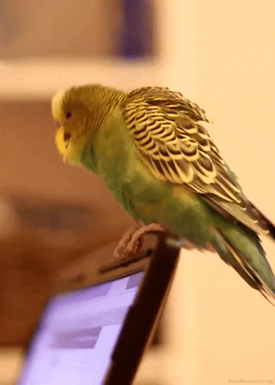
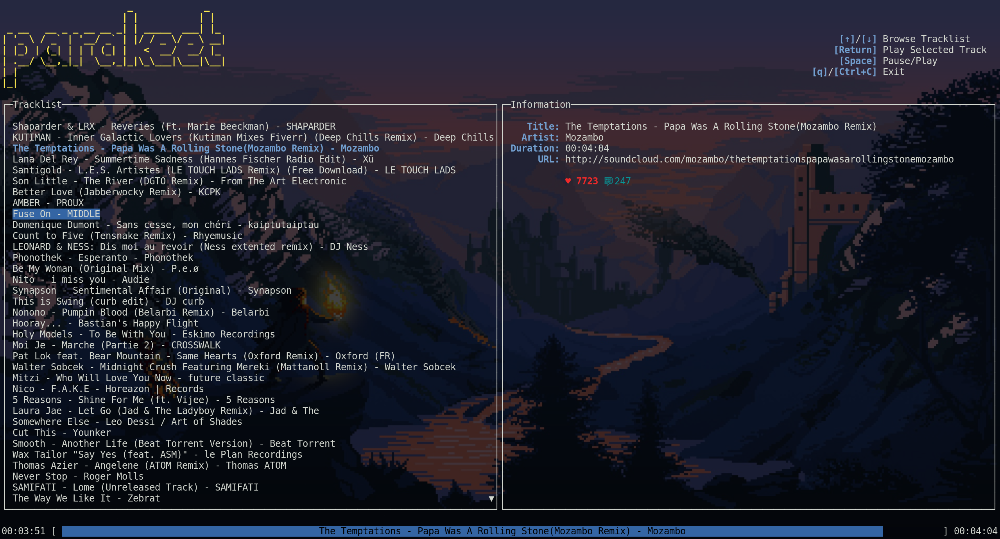

<h1 align="center">Parakeet</h1>
<h2 align="center">
  

  [](https://forthebadge.com)[](https://forthebadge.com)[](https://forthebadge.com)

  
  [](https://goreportcard.com/report/github.com/depado/parakeet)
  [](https://github.com/depado/parakeet/blob/master/LICENSE)
  [](https://saythanks.io/to/depado)

  SoundCloud player in your terminal
</h2>

Note: This is a work in progress. Documentation should be updated soon.
The code is currently in a **very** dirty state.



## Limitations

Currently, parakeet has some limitations:

- It will play only the last 50 favorites tracks from the user ID you provide
- It can't read Go+ sounds even if the client ID comes from a Go+ account
- Some tracks can't be fetched properly and will be skipped automatically

## Install

From source:

```sh
$ go get github.com/depado/parakeet
$ cd $GOPATH/src/github.com/depado/parakeet
$ make install
```

Alternatively you can download the binary release of parakeet on the 
[releases page](https://github.com/depado/parakeet/releases).

This project uses [beep](https://github.com/faiface/beep) which in turn uses 
[oto](https://github.com/hajimehoshi/oto) so make sure to check the 
[requirements](https://github.com/hajimehoshi/oto#prerequisite) before trying to 
run parakeet.

## Configure

For now this project needs both a SoundCloud client ID and a user ID. It will
fetch the first 50 favorite tracks of the user and will play them one after
another just like SoundCloud would in your browser or app.

### Environment Variables

Setup the following environment variables:

- `PARAKEET_CLIENT_ID`: Your SoundCloud client ID
- `PARAKEET_USER_ID`: Your SoundCloud user ID

### Flags

You can also pass these settings using flags when running parakeet:

```sh
$ parakeet --client_id <yourclientID> --user_id <youruserID>
```

## TODO

- [ ] Display more metadata in the information panel
- [ ] Allow to pass directly an URL to a playlist or user to stream music from
- [ ] Implement pagination
- [ ] Refactor player logic
- [ ] Handle clicks (move cursor in track, play/pause, etc)
